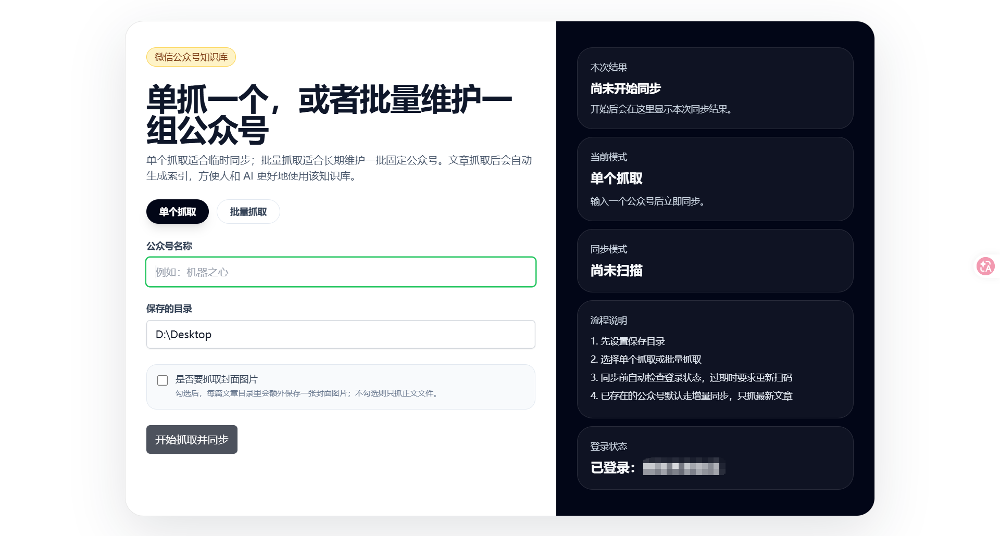

# WeChat Article Knowledge Base

公众号文章适合阅读，但不适合长期归档、持续同步和结构化复用。

一旦资料越来越多，你就会很快遇到几个问题：文章分散、后续更新难补、内容难检索，也不方便直接给 AI 使用。

WeChat Article Knowledge Base 的目标，就是把公众号文章从“零散页面”变成“可持续更新的本地知识库”。

## 它解决什么问题

- 抓取公众号文章，而不是只做零散下载
- 按公众号账号持续同步，而不是一次抓完就结束
- 给抓下来的内容做标签化、索引化和结构化整理
- 把文章沉淀成可供 AI 使用的本地知识库
- 降低长期维护公众号资料的整理成本和复用成本

## 它是什么

WeChat Article Knowledge Base 是一个基于 `wechat-article-exporter` 扩展出来的本地知识库工具。

它保留了原有的扫码登录和文章抓取流程，并把重点进一步推进到：

- 抓取公众号文章
- 按账号做全量同步与增量同步
- 给内容打标签 / 建索引
- 形成可供 AI 使用的本地知识库

## 特性

- 扫码登录微信公众号工作流
- 批量抓取和导出公众号文章
- 按账号执行首次全量同步
- 对已同步账号执行增量同步
- 按账号、文章和索引层组织本地数据
- 为分类、筛选、检索和后续 AI 使用预留标签 / 索引能力

## 适合谁使用

- 想长期归档公众号内容的个人用户
- 需要持续跟踪某些公众号的研究者和知识工作者
- 希望把公众号文章整理给 AI 使用的开发者
- 想做文章分类、检索、问答和索引的项目维护者

## 使用场景

- 建立自己的公众号知识库
- 持续同步某些重点公众号
- 为 AI 问答、摘要、RAG、知识检索准备本地语料
- 对公开文章做后续标签化、索引化和结构化处理

## 免责声明

本项目仅供学习交流使用。

如果本项目对任何第三方造成影响，可随时关闭本项目。

## Description

A local knowledge base tool for WeChat public account articles. It supports article fetching, account-based continuous sync, content tagging and indexing, and turns article archives into a local knowledge base for AI workflows.

## 文档入口

完整项目文档位于 `source/README.md`。
